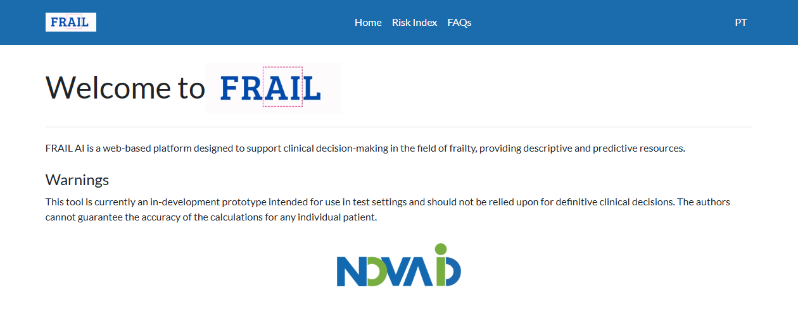
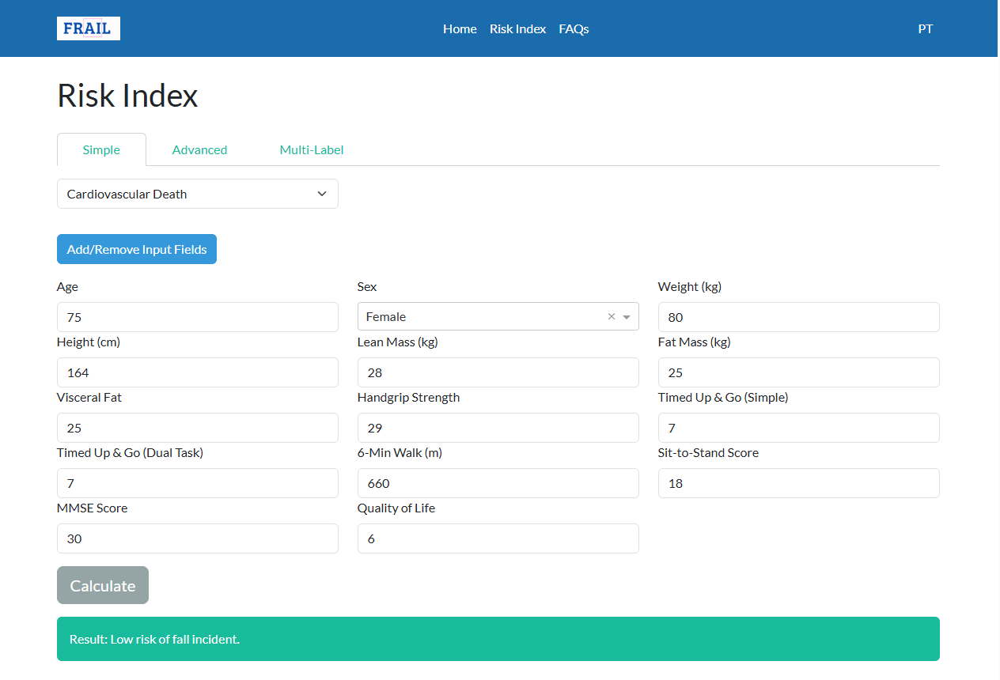

# [FR(AI)L](https://sciproj.ptcris.pt/176786PRJ): Intelligent decision support system for FRAILty assessment in the elderly population

This repository contains the code developed in the [FRAIL project](https://doi.org/10.54499/2024.07266.IACDC) and the decision support tool. 

Once downloaded/opened, the platform allows users to perform outcome predictions using the ML models developed for elderly individuals. The predictive models here implemented are described [here](https://www.medrxiv.org/content/10.64898/2026.03.13.26347338v1).

  

## Developed at

-   FR(AI)L is developed and maintaned at NOVA School of Science and Technology, Universidade NOVA de Lisboa.

*Authors:* [Henrique Anjos], [Rafael Costa](https://github.com/r-costa), Tiago dos Santos, Tiago Nobrega, José Pedreira, [Rui Henriques](http://web.ist.utl.pt/rmch/) (INESC-ID), Rui Oliveira, José Pinto, Daniel M. Gonçalves (FADEUP), Rui Baptista (CMVN Famalicão)

  

